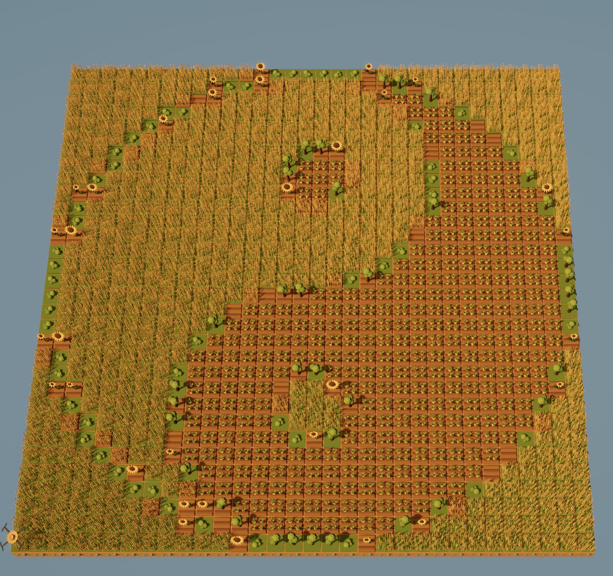

# Image To Field
#### Small converter to convert images/gifs/videos to data for the game "The Farmer Was Replaced"

This script is written for a 32x32 field with 32 drones.

Move the three files in the game script folder into your save folder. 
They should work without issues.

You can convert images by changing the paths in the main file and uncommenting the wanted functions.
Then copy the text from the output file into the "image_data.py" file in your game folder.

(I know, this is a great readme.)

